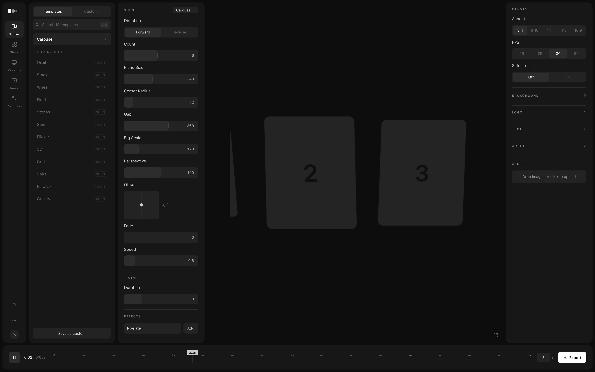

# motion-jitter-clone

Self-hosted 2D motion-graphics tool on localhost. Drag in images, pick a motion
template, tweak live controls, preview in real time, export MP4/GIF via native
ffmpeg. Personal use, single machine, no auth.



## Stack

- **Next.js** (App Router, TypeScript)
- **PixiJS v8** — sprites are image layers, filters are effects (GPU)
- **Zustand** — single live state, read every frame by the Pixi ticker
- **native ffmpeg** — deterministic frame-stepped export (`/api/export`)

## Run

```bash
npm install
npm run dev          # → http://localhost:3000
brew install ffmpeg  # required only for MP4/GIF export
```

## Architecture

```
Layers (assets → Pixi sprites, slots in order)
  → Motion   templates/*.ts  transform(frame, i, count, values, ctx)  ← SEAM 1
  → Composite (depth-sorted stage)
  → Effects  effects/*.ts    ordered Pixi filter stack                ← SEAM 2
  → getFrameState(frame) — ONE clock for live preview AND export
```

Principles: one live state read every frame · templates fully self-declare
their controls · full value reset on template switch · fixed 8-type control
vocabulary · shared `cardPath` helper (line / arc / ring / zwall).

## Templates (17 across 8 families)

Carousel, Wheel (fan/ring), Orbit (ellipse pass), Stack, Stories, Spin,
Flicker, Grid — each family is one file in `templates/`, variants are preset
bundles over the same pure transform (`templates/variant.ts`).

**Adding a motion** = one file: declare controls, compute `phase`, call
`cardPath`, map controls onto scale/alpha/rotation/depth, register in
`templates/index.ts`. The control panel, thumbnail, and export pick it up
automatically. Same for effects (`effects/`).

## Design system

Tokens extracted from the Figma reference (`styles/tokens.css`): `#171717`
cards (r14) on `#0d0d0d`, `#232323` tracks, `#2d2d2d` thumbs, 13px/#ccc labels,
10px/1.5px eyebrows, value-inside-track sliders, dashed-ruler timeline with a
playhead chip. `design-audit.png` is a 2× full-quality capture for auditing
typography and spacing.
