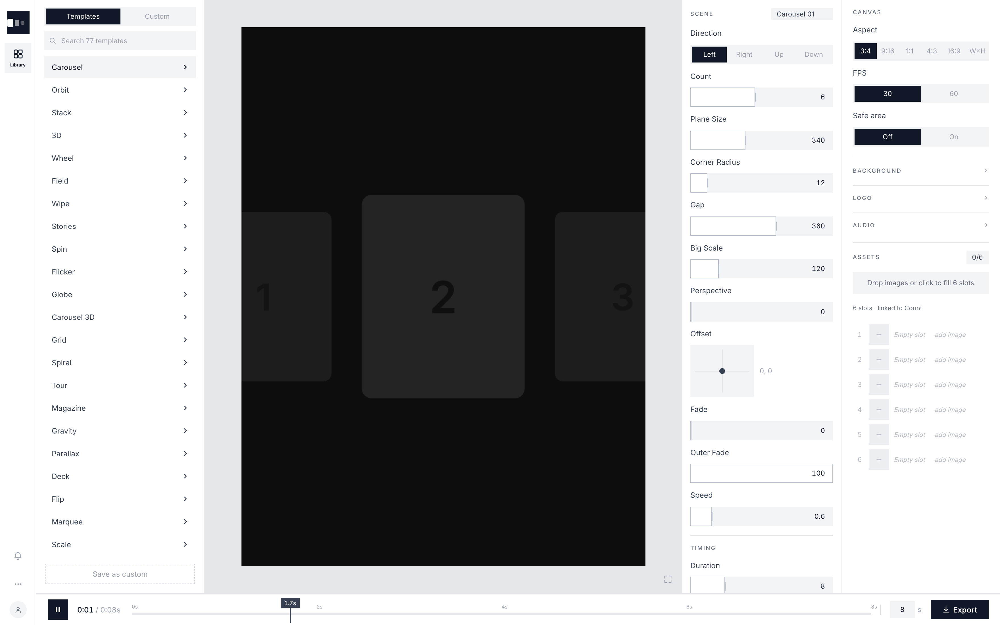

# motion-studio-open

An **open-source factory for quick videos and GIFs**. Drag in images, pick a
motion template, tweak live controls, preview in real time, and export MP4/GIF
via native ffmpeg. Runs self-hosted on localhost — single machine, no auth.



## Try it live

**https://appariciojunior.github.io/motion-studio-open/**

The hosted demo is a static build (auto-deployed from `main` via GitHub
Pages) — every template, control, and preview works in the browser. The only
exception is MP4/GIF export, which uses a native ffmpeg pipeline: clone the
repo and `npm run dev` to export.

## Stack

- **Next.js** (App Router, TypeScript)
- **PixiJS v8** — sprites are image layers, filters are effects (GPU)
- **Zustand** — single live state, read every frame by the Pixi ticker
- **native ffmpeg** — deterministic frame-stepped export (`/api/export`)

## Run

```bash
npm install
npm run dev          # → http://localhost:3000
brew install ffmpeg  # required only for MP4/GIF export
```

## Architecture

```
Layers (assets → Pixi sprites, slots in order)
  → Motion   templates/*.ts  transform(frame, i, count, values, ctx)  ← SEAM 1
  → Composite (depth-sorted stage)
  → Effects  effects/*.ts    ordered Pixi filter stack                ← SEAM 2
  → getFrameState(frame) — ONE clock for live preview AND export
```

Principles: one live state read every frame · templates fully self-declare
their controls · full value reset on template switch · fixed 8-type control
vocabulary · shared `cardPath` helper (line / arc / ring / zwall) · every
template ships a default easing curve (`lib/easing.ts`).

## Motion templates

17 families, 68 presets in `templates/` — each family is one file; variants are
preset bundles over the same pure transform (`templates/variant.ts`).

| Family | Motion |
|---|---|
| **Runway** | cards glide past in a row; the featured card grows at centre |
| **Orbit** | cards circle an ellipse — plus true-3D WebGL variants (`orbit3d.ts`) |
| **Shuffle** | a perspective deck: the front card lifts away, followers advance |
| **Ferris** | cards ride a rotating ring or fan arc |
| **Warp** | a starfield — cards drift out of depth toward the camera |
| **Takeover** | full-bleed images push in from an edge, hard-covering the last |
| **Spotlight** | one dominant featured card with neighbours peeking at the edges |
| **Pulse** | cards take turns at centre, cross-fading on a cycle |
| **Globe** | images tiled over a slowly spinning sphere (Fibonacci layout) |
| **Helix** | the camera corkscrews through a spiral staircase of cards |
| **Voyage** | a slow cinematic pan-and-zoom across a scattered collage |
| **Bounce** | cards drop and bounce on analytic physics (one-shot by design) |
| **Drift** | a multi-layer parallax wall; includes the seeded Scatter field |
| **Dive** | Ken-Burns zoom slideshow; includes the infinite Zoom tunnel |
| **Dock** | a dense tile grid; tiles near the focus point magnify, macOS-dock style |
| **Editorial** | magazine panels swept in one-by-one, held, swept out in reverse |
| **Canvas** | a blank, static slate to build from |

**Seamless loops.** Every template quantizes its speed to a whole number of
motif cycles per clip via `loopCycles()` (`lib/motion.ts`), so frame 0 ≡ frame
`totalFrames` and exported MP4/GIF loops never pop. Conveyor templates use
`period = count` so textures land back on their own slots. Templates that are
one-shot by design (Bounce) simply skip the helper. `meta.repeatAssets` lets
high-count fields (Dock, Editorial, Warp, Drift Scatter, Dive Zoom) cycle a
small image set across hundreds of layers.

**Deliberately not implemented** (from the reference-tool analysis): per-lane
offset sliders (a single lane-offset control covers it), a global `delay` param
(in a perfect loop it is just a phase rotation), and `count=0` auto-fill
(conflicts with the slot model; `repeatAssets` covers the intent).

## Easing

Every template carries a cubic-bezier easing curve editable in the Easing block
(`components/EasingPanel.tsx`). The preset library (`lib/easing.ts`) covers the
signature curves (Flow, Glide, Linear, Ease, Sweep, Smooth, Flip, Settle,
Snap), the standard Sine/Quad/Cubic/Quart/Expo families, physics curves
(Bounce, Spring, Wiggle, Overshoot), and hand-dragged custom beziers. The
renderer resolves the curve once per frame and reshapes each motion's cyclic
phase while keeping loops seamless.

## Design system

Light, Figma-style UI: flat white panels separated by 1px hairlines on a soft
grey stage, Tailwind-gray text scale, Inter, square corners. Every colour,
radius, and type size lives in one token sheet — `styles/tokens.css` — so
restyling the whole app is a one-file edit. A dark theme ships under
`:root[data-theme="dark"]`.

## Duplicate & contribute

Want your own copy or want to add to this one? The codebase is deliberately
small and seam-oriented — most contributions touch exactly one file.

**Get it running**

```bash
git clone <your fork>
cd motion-studio-open && npm install && npm run dev
npx tsc --noEmit   # the only required check — keep it clean
```

**Where things live**

```
templates/   one file per motion family + index.ts registry
effects/     Pixi filter effects (same self-declaring pattern)
lib/         renderer, easing, loop math, card paths, types
components/  panels (templates, controls, easing, timeline, preview)
store/       the single Zustand state
styles/      tokens.css — the entire visual system
app/api/     ffmpeg export route
```

**Add a motion template** (the most common contribution):

1. Copy the closest existing family in `templates/` to a new file.
2. Declare your controls (slider / segmented / xypad / toggle… — 8 fixed types)
   and give the family a `meta` block: id, name, group, `defaultEasing`.
3. Write the pure transform `(frame, i, count, values, ctx)` → position, scale,
   alpha, rotation, depth. Route your phase through `ctx.easedPhase` so the
   scene's easing curve applies, and quantize speed with `loopCycles()` so the
   clip loops seamlessly.
4. Register it in `templates/index.ts`. Done — the sidebar group, control
   panel, easing block, thumbnail, and export all pick it up automatically.
   Ship variants as preset bundles via `templates/variant.ts`.

Ground rules: transforms stay **pure and deterministic** (no `Math.random` —
use the seeded hash pattern in `field.ts`/`gravity.ts`), never read state
outside `values`/`ctx`, and keep template IDs stable once shipped (display
names can change freely; IDs are what saved projects reference).

**Restyle it**: edit `styles/tokens.css` only — components never hardcode
colours. **New effects**: same pattern as templates, in `effects/`.

## Collaborators

Thanks to [@quefreen](https://github.com/quefreen),
[@milkatx](https://github.com/milkatx), and
[@davicorrea0](https://github.com/davicorrea0) for the help, support, and
quick repo edits.